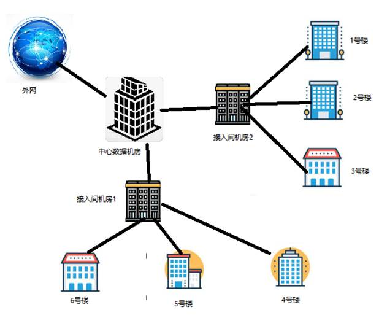

# ciscoNetwork-design
基于cisco思科模拟器的学校网络设计(简略版)
## 背景
某工业园区现有多栋办公楼建筑。其中数据机房含有包含核心设备，例如：核心交换机、路由器、HTTP服务器及DHCP服务器等，园区网出口汇聚到数据中心机房路由器，上联至外网ISP。请你按照现有条件，为该园区搭建局域网络，并使用vlan技术进行安全

隔离管理，其中1号楼、2号楼每栋用户不少于150人，其他建筑用户不少于100-50人；5号楼、6号楼采用有线和无线混合组网；全网采用rip路由协议；最终使得所有楼宇的终端能登录访问HTTP服务器。1-3号楼汇聚到接入间机房2,4-6号楼汇聚到接入间机房1。详细需求如下：

| 建筑         | 用户规模 | 网络连接方式 | 应用技术 | 备注                 |
| ------------ | -------- | ------------ | -------- | -------------------- |
| 5号楼        | 150以上  | 有线         | Vlan     | 每栋楼至少占一个vlan |
| 6号楼        | 150以上  | 有线         | Vlan     | 每栋楼至少占一个vlan |
| 1-2号楼      | 100以上  | 有线         | Vlan     |                      |
| 3号楼        | 50以上   | 有线+无线    | Vlan     |                      |
| 4号楼        | 100以上  | 有线+无线    | Vlan     |                      |
| 数据中心机房 |          | 有线         |          |                      |
| HTTP服务器   |          |              |          | 地址转换映射(NAT）   |
| DHCP服务器   |          |              |          | 无线用户IP 地址分配  |

 

 
